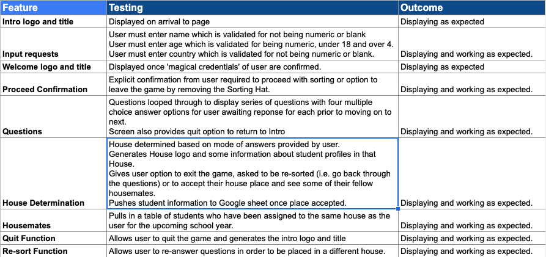
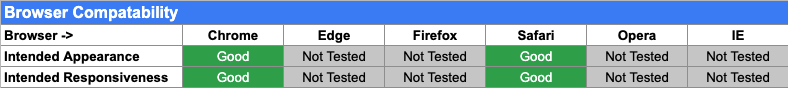
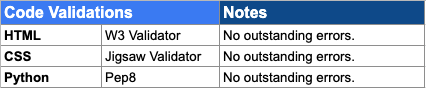

https://ascii-generator.site/ - to create ASCII version of images
https://stackoverflow.com/questions/23623288/print-full-ascii-art - how to insert ASCII images into Python
https://www.codespeedy.com/check-if-user-input-is-a-string-or-number-in-python/ - to check name input for digits instead of letters
https://pypi.org/project/colorama/ - to add yellow to lightning bolt
https://harrypotter.fandom.com/wiki/Hufflepuff - for about houses
https://pypi.org/project/tabulate/
https://pypi.org/project/colorama/

'''def generate_questions(): # only gave one/two questions then stopped - had to remove return answers
    """
    Runs through sorting hat questions
    """
    clear_display()
    answers = []
    for q in questions:  #https://stackoverflow.com/questions/33069253/looping-through-multiple-choice-questions
        print(q['question'])
        sleep(1)
        for i, c in enumerate(q['options']):
            print(chr(97 + i)+ ':', c)
            
        while True: 
            answer = input("Enter your answer:\n>>> ".center(70))
    
            if validate_answer(answer):
                print('\n\nThank you'.center(70))
                answers.append(answer)
                break

        sleep(1)
        clear_display()

        return answers'''

Bug
Questions were looping twice - was calling fucntion from within sort function and then again in main
Was breaking after two questions - 

Bug 
Was updating spreadsheet after welcome moved to after generate questions to update with all details (name etc plus house)
Moved house determination within function to be able to access house variable

Bug 
Centering text on line - not centring when using \n on line so included blank lines before instead of line breaks to ensure centring worked.

Bug
Initially pushing inputs and house to spreadsheet after first round of questions with option to re-sort. Trying to update house after re-sorting but changed to push details to spreadsheet once 'student' confirmed happy with house. 

Bug
Getting subset of spreadsheet to show housemates
Convert back to list of dictionaries
Use list comprehension 
https://www.i2tutorials.com/convert-list-of-lists-to-list-of-dictionaries/
https://stackoverflow.com/questions/63508906/get-all-keys-with-specific-value-in-dictionary-python
Looked at using pandas module

# Name That Hound 
***
## Overview 

Welcome to Name That Hound, a just-for-fun quiz to test your knowledge of dog breeds!

As a dog lover myself, I wanted to create a fun quiz of 10 multiple choice questions that can be played and enjoyed by any age. Each round generates a fresh mix of images so the game can be played time and time again.

## Live Site

[Name That Hound](https://lw83.github.io/name-that-hound/)

## Repository 

[GitHub Repository](https://github.com/LW83/name-that-hound/)
***
## Table of Contents:
* [**Name That Hound**](#name-that-hound)
  * [**Overview**](#overview)
  * [**Concept and Planning**](#concept-and-planning)
    * [**Target Audience**](#target-audience)
    * [**User Stories**](#user-stories)
    * [**Site Aims**](#site-aims)
    * [**Wireframes**](#wireframes)
    * [**Color Scheme**](#color-scheme)
    * [**Fonts**](#fonts)
  * [**Existing Features**](#existing-features)
    * [**Header**](#header)
    * [**Footer**](#footer)
    * [**Welcome Page**](#welcome-page)
    * [**Game Page**](#game-page)
    * [**Final Score Page**](#final-score-page)
  * [**Feature Enhancements**](#feature-enhancements)
  * [**Testing**](#testing)
    * [**User Story Testing**](#user-story-testing)
    * [**Features Testing**](#features-testing)
    * [**Responsiveness Testing**](#responsiveness-testing)
    * [**Browser Testing**](#browser-testing)
    * [**Accessibility Testing**](#accessibility-testing)
    * [**Code Validation Testing**](#code-validation-testing)
    * [**Fixed Bugs**](#fixed-bugs)
    * [**Unfixed Bugs**](#unfixed-bugs)
  * [**Deployment**](#deployment)
  * [**Credits**](#credits)
    * [**Media**](#media)
    * [**Languages Used**](#languages-used)
    * [**Tools and Online Resources Utilised**](#tools-and-online-resources-utilised)
    * [**Code Utilisation**](#code-utilisation)
    * [**People**](#people)
***
## Concept and Planning 

### UX

- __Target Audience__

   - Individuals passionate about the animals and dogs in particular and keen to test their knowledge of the various dog breeds.
   - Children and adults looking to play a free fun online game.
   - Parents/grandparents looking for an entertaining but educational game for their children/grandchildren to play or to play with them.

- __User Stories__

   - As a user, I want a free fun and eductional online game to play.
   - As a user, I want to be able to understand how to play the game.
   - As a user, I want to be able to easily navigate my way through the game.
   - As a user, I want to be able to personalise my experience of the game.
   - As a user, I want to be able to dictate the length of time I play.
   - As a user, I want to get feedback on my answers and progress in the game. 
   - As a user, I want to see my final score and have a conclusion to the game.
   - As a user, I want to be able to play the game again easily if I choose.
   - As a user, I want a different experience each time I play the game.

- __Site Aims__
 
  - The site aims to meet the above user requirements through the following: 
    -  Providing a free, online, education game to meet the target audience requirements.  
    -  Providing clear game instructions at the outset.
    -  Providing an easy and intuitive way to start, navigate and end or exit the game. 
    -  Enabling the user to personalise their game experience by submitting their name. 
    -  Enabling the user to play the game multiple times or to exit the game if they wish. 
    -  Providing feedback to the user throughout the game on their score and their answers to facilitate a learning experience. 
    -  Providing a game conclusion and overall final score and congratulatory message personalised to the user based on their score. 
    -  Providing an easy mechanism for the user to replay the game as many times as they wish. 
    -  Ensuring the user has a different experience of the game each time they play to ensure they wish to return to the game and to further the educational aspect of the game. 

### Wireframes
 Once I had decided on the theme for the site, I used Balsamiq to do some high level wireframes for the desktop and mobile versions of the site:

 __Welcome Page__
  
  - The homepage or welcome container was to welcome the user to the site, set out how to play the game and enable them to commence the game itself. 

 

 __Game Page__
  
  - The main game page sets out the generated dog image, the multiple choice answers and a submit button. The user also has the option to exit the game if they wish. 
  - Originally, I considered including a question line but in building the site I abandoned this as I felt it was intuitive and a waste of screen space to include a repeat 'What dog breed is this?' line. 

 

__Final Page__
  
  - The final page sets out a certificate image to congratulate the user on their final score. This screen also enables the user to play the game again or return to the Welcome page. 

 

### Color Scheme
- To decide on the color scheme for the site, I first selected the background-image. This image was selected from [Abode Images](https://stock.adobe.com/ie/).
- Once I had decided on the image, I used [Image Color Picker](https://imagecolorpicker.com/en) to identify different colors within the image to use as the basis for font, border and icon colors within the site. 
- In order to ensure the font colors selected had sufficient contrast to meet accessibility requirements, I validated the color palette using [Eight Shapes Contrast Grid](https://contrast-grid.eightshapes.com).

### Fonts
 - The fonts utilised are consistent across the page views and are from [Google fonts](https://fonts.google.com/). 
 - For the whole site, I have used the Poppins font as it was clean and simple. As there is a lot of imagery in the site I did not want a font that detracted from this or made the site overly fussy.   
 - Sans serif has been applied as a backup font. 

***
## Existing Features 

### Header

__Logo__

  - The logo is made up of the game and site name ("Name that Hound") and a logo image of a Boxer tilting his head as a nod to the fact that the game is a quiz game. The choice of boxer is also a nod to my own dog Hugo, a boxer!
  - This image has been taken from [DogTime](https://dogtime.com) and copyright remains with this source. 
  - [Remove.bg](https://www.remove.bg/upload) was used to remove the background of the images for use in header and [Simple Image Resizer](https://www.simpleimageresizer.com/upload) to resize image. 

  

__Favicon__

  -  A favicon has been added to show up in the title of the page and is a simple dog icon from Font Awesome. 
  
  

### Footer

  - I decided not to add a footer to the page as I did not feel the game needed it or benefitted from it. It may be worth adding in the future if there are relevant social media pages to be linked to. 

### Welcome Page

  - The welcome page is a clean box which welcomes the user and sets out simply the instructions for the game. 
  - Included in this page is a text box for the user to enter their name, which is then used to personalise the final score certificate generated at the end of the game. 
  - Finally the page view contains a button to start the game which has a hover effect and pointer added to provide additional feedback to the user. 

  
  

### Game Page

  - The main game page of the site is contained in a single container for a clean user interface. 
  - The background color of the game container is consistent with the bone and paw image color in the background image for aesthetic purposes. 
  - The game container comprises of the randomly generated dog image from an array created, a multiple choice answer section with four answer options generated, a submit button, a score container and an exit icon. 
  

  - The answer options are multiple choice options including the correct answer and three other options shuffled to ensure the correct answer placement is not predictable. 
  - These are presented as radio button options for the user to select. 

  - As with the Play the Game button in the Welcome page, the Submit button has a hover effect and pointer added to provide additional feedback to the user. 
  - Where the user presses the Submit button without selecting an answer, an alert message pops up to ask the user to select an answer in order to proceed with the game. 

   - Once an answer has been selected and submitted, the submit button changes to a "Next Question" button. Originally I had the next question button appear in addition to the Submit button but then decided to replace it to only show the Next Question button in order to further simplify navigation for the user. 
  

   - If the correct answer has been selected, the user is notified that the answer is correct, the correct scores number increases by one and the total questions asked increases by one. 
   - A Font Awesome icon of a paw has been added to this message simply to create a bit more fun in the game. 
   - The correct answer message is also styled in green to denote a positive answer. 

   
   - If an incorrect answer has been selected, the user is notified that the answer is incorrect and what the correct answer was in order to facilitate learning the breed. The correct scores number remains unchanged and the total questions asked increases by one. 
   - Similar to the correct answer, a Font Awesome icon of a broken heart has been added to this message and it is styled in dark red to denote a negative answer.  

  - Finally the game page has an exit icon should the user wish to exit the game before it is finished. This icon takes the user back to the Welcome page of the site. 

### Final Score Page

  - The final score page of the site is designed to act as a certificate with a message generated for the user based on their inputted user name and the score achieved. 
  - This is intended as a conclusion to the game but also a bit of fun for younger users. 
  - This image has been taken from [ImgFlip](https://imgflip.com/) and copyright remains with this source. 
  - [Remove.bg](https://www.remove.bg/upload) was used to remove the background of the images for use in header and [Simple Image Resizer](https://www.simpleimageresizer.com/upload) to resize image. 

  - Included on the page are two buttons, one to play the game again directly and the second to return to the Welcome page of the site. 
  - Consistent with the other site pages, the buttons have a hover effect and pointer added to provide additional feedback to the user. 

***
## Feature Enhancements

 - Potential additional future features for the site include: 
      - Image selection: As the image is currently randomly generated from an array of dogs, there is the possibility that the same image is generated within a round of 10 questions. This is something I would like to work on removing in a future iteration of the game to further enhance the user experience. 

      - Difficulty levels: There are a few options for potentially adding difficulty levels to the game:
        1. Subjectively splitting dogs based on how common they are and a perception as to how difficult it may be to name their breed. This however would limit the number of options in each category and would mean that each image appears more frequently for the game type selected. 
        2. Changing the game type to increase difficulty such as adding a free text box to guess the name or number of spaces with letter clues. A free text box version would require accepting varations of names for example a German Shepherd may also be referred to as an Alsatian. 

      - For the current build of the game I ruled out implementing a timer as I felt it did not add to the game. I also considered and ruled out a leaderboard on the basis that a round is limited to ten questions and as a result there would not be sufficient variation in scores. However, if difficulty levels were added and potentially different score variables for difficulty level it may be more justified to add a leaderboard. 
       
***
## Testing 

### User Story Testing

 - All user stories identified have been tested against the final design with the outcome of this testing set out below. 
 - The game has also been tested by family and friends with positive feedback. 

### Features Testing
 - All design features have been manually tested with the outcome of this testing set out below. 

### Responsiveness Testing
 - Responsiveness of the site was tested using Dev Tools for all screen size widths from 320px up to 2000px.
 - The user experience starts to diminish at screen sizes under 300px. 
 - Responsiveness was also specifically checked for the following devices either virtually within Dev Tools and/or physically where possible:

 - Specific breakpoints for each page were identified and managed through media queries. These were focused on adjusting the layout of boxes on the page, the size of margins and padding and also adjusting the font-size for smaller screen sizes. 

 - Images of the various page views are included for: 
          - [iPhone XR](./docs/iphone_screenshots/)
          - [iPad Air](./docs/ipad_screenshots/)
          - [Macbook](./docs/macbook_screenshots/)

### Browser Testing
  - The site was developed and tested using Google's Chrome browser. 
  - The site has also been tested on Safari and functions as intended. 

### Accessibility Testing 

  - By the nature of the fact that this is an image based quiz, this may present challenges for visually impaired users. To the extent possible this has been mitigated by including alt tags with a description of the dog image excluding the breed name to try and facilitate usage of the game by visually impaired individuals. 
  - The accessibility of the site has also been tested through the following tools with no issues: 

    - Dev Tools Lighthouse Report (screenshot included in Code Validation Testing section below)
    - [Wave (Web Accessibility Evaluation Tool)](https://wave.webaim.org/)
          - [Wave Test](./docs/wave.png)
          - [Wave Summary](./docs/wave2.png)

  - The following aspects of the site development have been specifically included with accessibility in mind: 
    - For all images, alt tags with appropriate descriptions have been applied.
    - Keyboard navigation for the site has been tested and is functioning as expected. 
    - All color contrasts have been tested and validated for areas with text. 
    - Semantic HTML tags have been used including headers, nav, h1, h2, h3, section, footer. 
 
### Code Validation Testing 

  - The site code has been passed through the following online validation tools: 

  

__HTML Validation__
  
  - No errors remain for the site when passing through the official W3C Validator. 

  

  - When first passed through the validator, two errors were raised in relation to alt tags that had been applied to the exit door icon. These were since removed. 

  

__CSS Validation__
  
  - No errors were found when passing through the official W3C Validator.
  
  

  - One warning remains from the CSS validation which is not considered of significant impact. 

  

__Javascript Validation__

  - No errors were found when passing through the official JSHint Validator. 

  

  - Some warnings were raised regarding missing semicolons which were since corrected. 
  - One warning was raised about the use of a for in loop that was being used in the generation of answer options function. This was changed to a for let loop to mitigate the risks created from using a for in loop and this warning was remediated.  
 
  

  - One warning remains which is not considered of significant impact. 
  
__Lighthouse Report__
  - In addition to the HTML, CSS and JS Validation, a mobile and desktop lighthouse report for the site was generated through Dev Tools with positive scores.

  

  

### Fixed Bugs   
  - The following key bugs arose and were fixed during the development of the game: 

    1. Bringing in images: 
          - Issue: Initially I was struggling with how to structure an array to include images and how to then access those images in subsequent functions to generate the dog image required as the basis for the game. 
          - Solution: After some research online (primarily Stack Overflow), I structured the images as an array of objects and ensured I had the correct file path structure for accessing the images in the JS script. Finally, I corrected some typos in the template literal wording I had to bring the images into the DOM and this enabled the images to be visible.
          - Resource: Stack Overflow

    2. Generating random answers and pushing into an array:
          - Issue: Originally, I created a function which generated a value and was running the function three times to try to push the value generated each time into an array using the following code: 
                        
                        let answerOptions = []
                        
                        function generateAnswerOptions () {
                              let newNum = Math.floor(Math.random() * dogs.length);
                              let addDogs = dogs[newNum];
                              let addDogName = addDogs.name;
                                  return addDogName;
                        }
       
                        for (var i = 0; i < 3; i++) {
                                generateAnswerOptions ();
                                answerOptions.push(addDogName);
                        }
          - Solution: As the dogName variable didn't exist outside the function the above code was not working, so I needed to call the function as part of the loop i.e. answerOptions.push(generateAnswerOptions()). 
          - Resource: Slack and specifically Mike Avgeros for his input on this. 
          - Note: I subsequently changed some of the structure of the code here to facilitate the generation of unique answer options. I also made the dogName variable global in order to be accessible outside of the generateGame function. This was based on research from codegrepper.com. 

    3. Not picking up the value of the radio button selected:  
          - Issue: The radio buttons were not picking up the dog name but were showing as numbers. 
          - Solution: I hadn't applied a value in creation of radio buttons which once included to reflect the assigned random answer was retested and worked as required.
          - Resource: Stack Overflow
    
    4. Lining up answers with radio buttons:
          - Issue: Initially, I struggled with generating the radio button options with the buttons showing up in a straight line rather than stacked or showing up as lines of all options. 
          - Solution: In order to stop all four options showing in one line, I needed to include the [i] after answerOptions. To stop the buttons appearing one after another in a line I add a   tag into the code. Finally I found that these answer options generated needed to be pushed into a new array (finalAnswerOptions) in order to be pushed as radio buttons to display correctly in the DOM. 
          - Resource: General review of course notes and trial and error. 

    5. Generation of unique answer option: 
          - Issue: When first enabled, the anwer options randomly generated based on the below code could generate an option that was the same as the correct answer or generate the same incorrect answer twice resulting in the same option appearing multiple times in the multiple choice options for a given image. 
                      
                      function generateAnswerOptions () {
                      let newNum = Math.floor(Math.random() * dogs.length);
                      let addDogs = dogs[newNum];
                      return addDogs.name;
                      }
        
                      for (var i = 0; i < 3; i++) {
                              generateAnswerOptions ();
                              answerOptions.push(generateAnswerOptions());
                      }

          - Solution: After some research, I found a solution on Stack Overflow to create a number variable created from the dogs array, randomly sort this numbers variable, take the first number to generate the quiz image and associated dog name before taking the next three unique numbers to generate answer options. 
          - Resource: [Stack Overflow](https://stackoverflow.com/questions/2380019/generate-unique-random-numbers-between-1-and-100)

### Unfixed Bugs
- The two bugs that remain unfixed are: 

  - Focus on radio buttons: I wanted to add .focus() to the radio buttons so that the first radio button was already selected for the user when the Game page was generated. Despite researching solutions on Stack Overflow and trying to apply the focus based on ID and name and selected the first element of the array, this functionality did not appear to work so it is something I would like to try and resolve in the future. The focus was added to the name box on the Welcome page successfully. 

  - Duplicate images: As noted above, currently the images are randomly generated from an array. Due to this struture in a given round of 10 questions, there is a chance that the same image may appear for the user. Whilst this does not affect the functionality of the game it is something I would like to try and resolve in a future fix to further enhance the user experience. 

- I would like to fix both of the above for a future iteration of the game. 

***
## Deployment

- The site was deployed to GitHub pages following the below deployment steps: 
  - In the GitHub repository, navigating to the Settings tab 
  - From the source section drop-down menu, selecting the Master Branch
  - Once the master branch was been selected, the page automatically refreshed with a detailed ribbon display to indicate the successful deployment. 

The live link can be found here: [Name That Hound](https://lw83.github.io/name-that-hound/) 

***
## Credits  

### Media
 - The winking dog image utilised in the final certificate was taken from [ImgFlip](https://imgflip.com/).
 - All other dog images used in the site have been taken from [DogTime](https://dogtime.com) and copyright remains with this source.
 - The background image used for the site has been downloaded from [Adobe Stock Images](https://stock.adobe.com/ie/). 
 - The border for the final score certificate was downloaded from [istock photo](https://www.istockphoto.com/search/2/image?mediatype=illustration&phrase=dog+borders) and copyright remains with this source.

### Languages Used
  - HTML5
  - CSS3
  - Javascript

### Tools & Online Resources Utilised
 - Being new to Javascript, I found there was a lot of trial and error as part of this project and a lot of general research, I have tried to be as complete as possible in noting the resources that were utilised in getting to the final build of the game. 

 - The following tools and resources have been utilised in the creation of this project: 
     - [Balsamiq](https://balsamiq.com/): For creation of wireframes. 
     - GitHub & Gitpod: For development and deployment of the site. 
     - [Image Color Picker](https://imagecolorpicker.com/en): To match colours from the background image for use in color theme of site. 
     - [Google Fonts](https://fonts.google.com/): For site fonts. 
     - [Compressor.io](https://compressor.io/): For compressing image file sizes. 
     - [Font Awesome](https://fontawesome.com/): For icons used across the site. 
     - [Remove.bg](https://www.remove.bg/upload): To remove background of images for use in header.
     - [Simple Image Resizer](https://www.simpleimageresizer.com/upload): to resize image header and certificate images.
     - [W3 Schools](https://www.w3schools.com/js/js_random.asp): For general guidance and research and for further direction on how to create a random number used for generating image in game.  
     - [Stack Overflow](https://stackoverflow.com/questions/19089018/how-to-align-form-at-the-center-of-the-page-in-html-css): For general guidance and research - specific examples used in final build set out below. 
     - [Wave (Web Accessibility Evaluation Tool)](https://wave.webaim.org/): For accessibility checks
     - [Eight Shapes Contrast Grid](https://contrast-grid.eightshapes.com): For color contract checks
     - [Slack](https://slack.com/intl/en-ie/): For general guidance and research on project considerations. 
     - Google Chrome Dev Tools: For validation and responsiveness checks
     - [Python Tutor](https://pythontutor.com/): For testing code throughout development
     - [Am I Responsive](https://ui.dev/amiresponsive): To create the multi-device screenshot for inclusion in my Readme file. 
     - [W3C CSS (Jigsaw) Validator](https://jigsaw.w3.org/css-validator/)
     - [W3C HTML Validator](https://validator.w3.org/)
     - [JSHint Validator](https://jshint.com/)
     - Code Institute & Love Maths Demonstration: For guidance and inspiration for this site. 

     Specific Online Resources utilised as references: 
      - Creating a quiz with random questions from an array: https://stackoverflow.com/questions/70983009/im-creating-a-quiz-with-5-random-questions-out-of-an-array-with-20-i-want-to
      - Accessing nested objects array: https://stackoverflow.com/questions/11922383/how-can-i-access-and-process-nested-objects-arrays-or-json
      - Accessing random item from array: https://stackoverflow.com/questions/5915096/get-a-random-item-from-a-javascript-array
      - Calling a function multiple times: https://stackoverflow.com/questions/44008092/how-to-call-a-function-multiple-times
      - Identifying selected radio button: https://stackoverflow.com/questions/7275597/getting-the-selected-radio-without-using-id-but-name
      - Identifying selected DOM elements: https://developer.mozilla.org/en-US/docs/Web/API/Document_object_model/Locating_DOM_elements_using_selectors
      - Generating unique random numbers: https://stackoverflow.com/questions/2380019/generate-unique-random-numbers-between-1-and-100
      - Showing and hiding divs for different sections of the game: https://sebhastian.com/javascript-show-hide-div-onclick-toggle/#:~:text=To%20display%20or%20hide%20a,which%20is%20block%20)%20to%20none%20.
      - Accessing a variable outside a function:(https://www.codegrepper.com/code-examples/javascript/how+to+access+variable+outside+function+in+javascript)

### Code Utilisation
 - The following elements of code have specifically been utilised from the following sources: 
    - function shuffle(array) - from [Stack Overflow](https://stackoverflow.com/questions/2450954/how-to-randomize-shuffle-a-javascript-array): This was added to shuffle the array of answers to ensure placement of the correct answer was not predictable. 
    - .btn:focus CSS styling - from [ZellWk](https://zellwk.com/blog/style-hover-focus-active-states/): This was used to enhance accessibility. 
    - Pushing answer options to multiple choice radio buttons: https://www.sitepoint.com/simple-javascript-quiz/: This was used to push the generated answer options to radio buttons in the DOM. 

### People
 - In addition a big thank you to the following people for their assistance in this project:
     - Kasia Bogucka: Our cohort facilitator for keeping us all on track and answering all and any of the many questions!
     - My cohort: For our weekly checkins and tips
     - Mike Avgeros: For responding to my query on Slack as set out in more detail in the Bugs section above. 