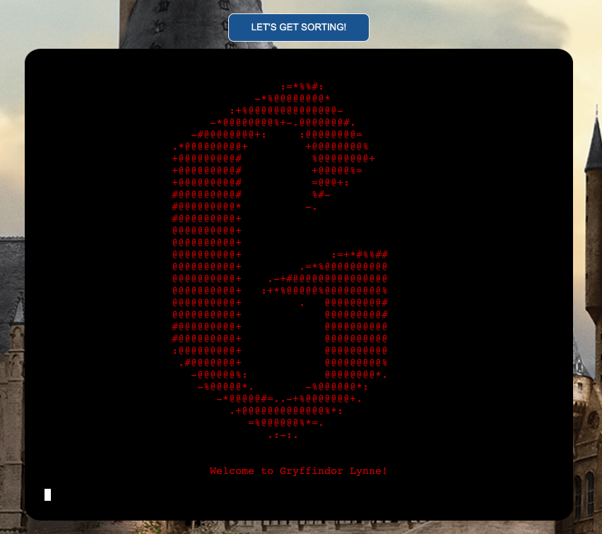
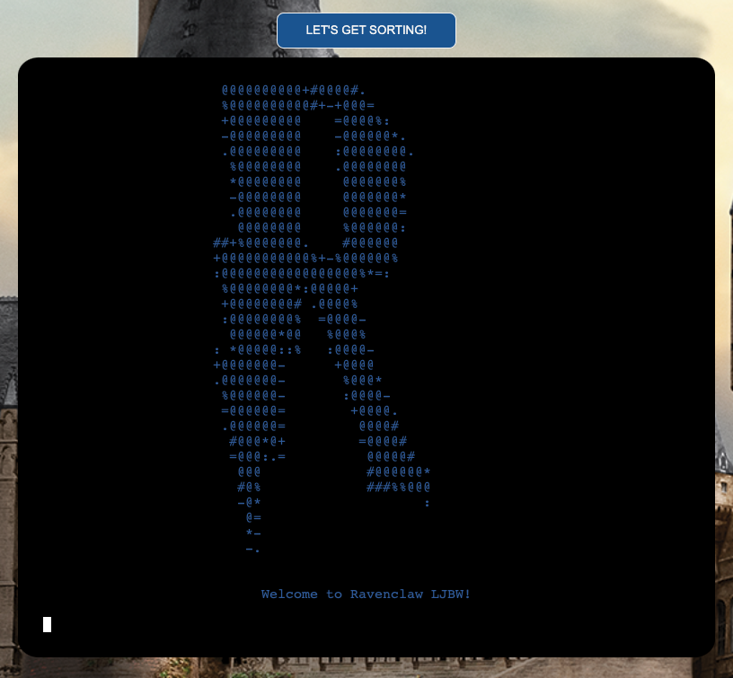

'''def generate_questions(): # only gave one/two questions then stopped - had to remove return answers
    """
    Runs through sorting hat questions
    """
    clear_display()
    answers = []
    for q in questions:  #https://stackoverflow.com/questions/33069253/looping-through-multiple-choice-questions
        print(q['question'])
        sleep(1)
        for i, c in enumerate(q['options']):
            print(chr(97 + i)+ ':', c)
            
        while True: 
            answer = input("Enter your answer:\n>>> ".center(70))
    
            if validate_answer(answer):
                print('\n\nThank you'.center(70))
                answers.append(answer)
                break

        sleep(1)
        clear_display()

        return answers'''

Bug
Questions were looping twice - was calling fucntion from within sort function and then again in main
Was breaking after two questions - 

Bug 
Was updating spreadsheet after welcome moved to after generate questions to update with all details (name etc plus house)
Moved house determination within function to be able to access house variable

Bug 
Centering text on line - not centring when using \n on line so included blank lines before instead of line breaks to ensure centring worked.

Bug
Initially pushing inputs and house to spreadsheet after first round of questions with option to re-sort. Trying to update house after re-sorting but changed to push details to spreadsheet once 'student' confirmed happy with house. 

Bug
Getting subset of spreadsheet to show housemates
Convert back to list of dictionaries
Use list comprehension 
https://www.i2tutorials.com/convert-list-of-lists-to-list-of-dictionaries/
https://stackoverflow.com/questions/63508906/get-all-keys-with-specific-value-in-dictionary-python
Looked at using pandas module

Bug - originally checked is entry was only digits changed from is numeric (would accept letters and digits to is alpha only accepting letters)
def validate_name(name):
    """
    Raises error if name entered is numerical
    or is blank.
    """
    try:
        if name.isalpha() is False:
            raise ValueError(
             f"\nPlease enter your name as text, you entered {name}"
            )
        elif len(name.strip()) == 0:  # rockymiss see Readme notes
            raise ValueError(
             "\nPlease enter your name, we need this to ensure you can be "
             "accepted to Hogwarts"
            )
        else:
            return True
    except ValueError as e:
        print(f"{e}, please try again.\n")
        return False
    return True

    Changed back to is numeric as was not accepting space in name/country e.g. South Africa. 

    Unfixed bugs
    1) Allows input before question finished - tried to freeze keyboard
    2) Validation - name and country only accept letters 

# The Sorting Hat 
***
## Overview 

Welcome to The Sorting Hat, a Harry Potter-themed quiz to determine which Hogwarts House you will be in for the upcoming school term! This is a purely for fun quiz for Harry Potter fans to simulate the experience of wearing the Sorting Hat from the books. 

This site has been created purely for demonstrating Python skills learned as part of the Code Institute's Diploma in Full Stack Software Development. No copyright infringement is intended. 

## Live Site

[The Sorting Hat](https://sorting-hat-22.herokuapp.com/)

## Repository 

[GitHub Repository](https://github.com/LW83/sorting_hat)
***
## Table of Contents:
* [**The Sorting Hat**](#the-sorting-hat)
  * [**Overview**](#overview)
  * [**Concept and Planning**](#concept-and-planning)
    * [**Target Audience**](#target-audience)
    * [**User Stories**](#user-stories)
    * [**Site Aims**](#site-aims)
  * [**UX**](#ux)
    * [**Wireframes**](#wireframes)
    * [**Background Styling](*background-styling) 
  * [**Existing Features**](#existing-features)
    * [**Game Landing Page**](#game-landing-page)
    * [**User Inputs**](#user-inputs)
    * [**Welcome Page**](#welcome-page)
    * [**Questions**](#questions)
    * [**House Determination**](#house-determination)
  * [**Feature Enhancements**](#feature-enhancements)
  * [**Testing**](#testing)
    * [**User Story Testing**](#user-story-testing)
    * [**Features Testing**](#features-testing)
    * [**Responsiveness Testing**](#responsiveness-testing)
    * [**Browser Testing**](#browser-testing)
    * [**Accessibility Testing**](#accessibility-testing)
    * [**Code Validation Testing**](#code-validation-testing)
    * [**Fixed Bugs**](#fixed-bugs)
    * [**Unfixed Bugs**](#unfixed-bugs)
  * [**Deployment**](#deployment)
  * [**Credits**](#credits)
    * [**Media**](#media)
    * [**Languages Used**](#languages-used)
    * [**Tools and Online Resources Utilised**](#tools-and-online-resources-utilised)
    * [**Code Utilisation**](#code-utilisation)
    * [**People**](#people)
***
## Concept and Planning 

### UX

- __Target Audience__

   - Individuals passionate about the Harry Potter.
   - Children and adults looking to play a free fun online game.
   - Parents/grandparents looking for an entertaining game for their children/grandchildren to play.

- __User Stories__

   - As a user, I want a free fun online game to play.
   - As a user, I want to be able to easily navigate my way through the game.
   - As a user, I want to be able to personalise my experience of the game.
   - As a user, I want to be able to dictate the length of time I play.
   - As a user, I want to see my final House and have a conclusion to the game.

- __Site Aims__
 
  - The site aims to meet the above user requirements through the following: 
    -  Providing a free, online, fun game to meet the target audience requirements.  
    -  Providing an easy and intuitive way to start, navigate and end or exit the game. 
    -  Enabling the user to personalise their game experience by submitting their name, age and country. 
    -  Enabling the user to play the game multiple times or to exit the game if they wish. 
    -  Providing a game conclusion and final house determination and details of fellow housemates for the upcoming term. 

## UX

### Wireframes

As this is a command line based quiz with a static background, I did not create wireframes for the site.

### Background Styling
- To add some aesthetics to the site and improve UX, I added a Harry Potter themed background-image. This image was selected from [The Wizarding World of Harry Potter](https://www.wizardingworld.com/features/try-out-our-new-harry-potter-video-call-backgrounds).
- I also used [Image Color Picker](https://imagecolorpicker.com/en) to identify a color from another Harry Potter image on the same site to use as the basis for the styling of the button.

***
## Existing Features 

### Game Landing Page

__Favicon__

  -  A image of the Sorting Hat has been added as a favicon for the page. 
  
  

__Logo__

  - The initial load of the page is comprised of a logo of the Harry Potter initials in the Harry Potter font generated in ASCII. 
  - [ASCII-Generator](https://ascii-generator.site/) was used to convert images to ASCII for inclusion in the page. 
  - The [Colorama](https://pypi.org/project/colorama/) module has been used to color this logo text for improved aesthetics. 
  - There is a sleep delay applied to this page for 5 seconds before the display is cleared and inputs requested from the user. 

  

### User Inputs

  - I deliberately decided not to give any information about the game prior to asking for user inputs to maintain a level of secrecy and mystique to the application. 
  - The user is requested to input their name, age and country prior to proceeding. 
  - Name and country inputs are validated to ensure they are not blank and are not soley numerical.
  - Age inputs are validated to ensure they are not blank, are numerical and are between the school-going ages of 4 and 18!
  - These inputs are pushed into a student object for use throughout the game. 

  
  
  

   - Once the user has inputted valid inputs, the computer takes these details to "validate" that the student is magical and not a Muggle!
   - A delay has been added to help create this illusion that background checks are being performed on the users information. 

  

### Welcome Page

  - Once the users non--muggle status has been confirmed they are brought to a new console view welcoming them to Hogwarts. 
  - Again, both the ASCII Generator and Colorama module have been utilised to create a yellow lightning bolt image above the welcome text. 
  - The datetime module has been utilised to get the current year so that this will update to the current year whenever the game is being played.  
  

  - The user is then asked if they want to get started or if they wish to remove the Sorting Hat i.e. quit.
  - The answer input must by y or n and validations are in place to ensure no blank entry or other character is accepted. 

  - If the user enters n they see the follow message and are then brought back to the landing page view. 

### Questions

  - When the user has decided to proceed, they are brought through a series of 11 questions with 4 answer options. 
  - Each question is displayed with a small delay before the answer options are displayed.  
  - After each question the console display is cleared again to improve UX. 

  - Again, validations are in place to ensure the user enters a,b,c or d as their answer or alternatively opts to quit the game. 

  - Once an answer has been entered, the next question appears. No feedback is provided on the answer as the quiz is not a right or wrong quiz. 
  - Answers are pushed to an answers list for use in subsequently determining the correct House for the user. 

### House Determination

  - Once all questions have been answered the statistics module imported is used to calculate the mode of the answer list. 
  - Each answer is a question corresponds to a House so the mode maps to which House the user should be placed. 
  - The console then clears to display the initial logo of the House determined for the user in the House colors. 
  - Again, ASCII Generator and Colorama have been used to create these colored logos. 

  - The user is then told a bit about the typical characteristics of students in their House.  

  - At this point, the user has three options; to enter h to accept their designated House, to press r to re-sort them into a new house or to press q to quit the game and return to the landing page. 
  - If the user selects r, they are brought back to the first question of the loop to run through and provide new answers. 
  - If the user selects q, the quit message is again displayed for the user and they are brought back to the starting landing page. 
  - If the user selects h, their final student details including determined house are pushed to a Google spreadsheet and they are brought to the concluding view and shown a list of housemates that will be in their year.
  - This list is pulled from Google sheets using an API and extracts entries where the House matches that of the user. 

  - This final view is also time delayed to display for 7 seconds before the console clears and the landing page is displayed again. 

***
## Feature Enhancements

 - Potential additional future features for the site include: 
      - Image selection: As the image is currently randomly generated from an array of dogs, there is the possibility that the same image is generated within a round of 10 questions. This is something I would like to work on removing in a future iteration of the game to further enhance the user experience. 

      - Difficulty levels: There are a few options for potentially adding difficulty levels to the game:
        1. Subjectively splitting dogs based on how common they are and a perception as to how difficult it may be to name their breed. This however would limit the number of options in each category and would mean that each image appears more frequently for the game type selected. 
        2. Changing the game type to increase difficulty such as adding a free text box to guess the name or number of spaces with letter clues. A free text box version would require accepting varations of names for example a German Shepherd may also be referred to as an Alsatian. 

      - For the current build of the game I ruled out implementing a timer as I felt it did not add to the game. I also considered and ruled out a leaderboard on the basis that a round is limited to ten questions and as a result there would not be sufficient variation in scores. However, if difficulty levels were added and potentially different score variables for difficulty level it may be more justified to add a leaderboard. 
       
***
## Testing 

### User Story Testing

 - All user stories identified have been tested against the final design with the outcome of this testing set out below. 
 - The game has also been tested by family and friends with positive feedback. 

### Features Testing
 - All design features have been manually tested with the outcome of this testing set out below. 

### Responsiveness Testing
 - Responsiveness of the site was tested using Dev Tools for all screen size widths from 320px up to 2000px.
 - The user experience starts to diminish at screen sizes under 300px. 
 - Responsiveness was also specifically checked for the following devices either virtually within Dev Tools and/or physically where possible:

 - Specific breakpoints for each page were identified and managed through media queries. These were focused on adjusting the layout of boxes on the page, the size of margins and padding and also adjusting the font-size for smaller screen sizes. 

 - Images of the various page views are included for: 
          - [iPhone XR](./docs/iphone_screenshots/)
          - [iPad Air](./docs/ipad_screenshots/)
          - [Macbook](./docs/macbook_screenshots/)

### Browser Testing
  - The site was developed and tested using Google's Chrome browser. 
  - The site has also been tested on Safari and functions as intended. 

### Accessibility Testing 

  - By the nature of the fact that this is an image based quiz, this may present challenges for visually impaired users. To the extent possible this has been mitigated by including alt tags with a description of the dog image excluding the breed name to try and facilitate usage of the game by visually impaired individuals. 
  - The accessibility of the site has also been tested through the following tools with no issues: 

    - Dev Tools Lighthouse Report (screenshot included in Code Validation Testing section below)
    - [Wave (Web Accessibility Evaluation Tool)](https://wave.webaim.org/)
          - [Wave Test](./docs/wave.png)
          - [Wave Summary](./docs/wave2.png)

  - The following aspects of the site development have been specifically included with accessibility in mind: 
    - For all images, alt tags with appropriate descriptions have been applied.
    - Keyboard navigation for the site has been tested and is functioning as expected. 
    - All color contrasts have been tested and validated for areas with text. 
    - Semantic HTML tags have been used including headers, nav, h1, h2, h3, section, footer. 
 
### Code Validation Testing 

  - The site code has been passed through the following online validation tools: 

  

__HTML Validation__
  
  - No errors remain for the site when passing through the official W3C Validator. 

  

  - When first passed through the validator, two errors were raised in relation to alt tags that had been applied to the exit door icon. These were since removed. 

  

__Python Validation__

  - No errors were found when passing through the official XXX Validator. 

  

  - Some warnings were raised regarding missing semicolons which were since corrected. 
  - One warning was raised about the use of a for in loop that was being used in the generation of answer options function. This was changed to a for let loop to mitigate the risks created from using a for in loop and this warning was remediated.  
 
  

  - One warning remains which is not considered of significant impact. 
  
__Lighthouse Report__
  - In addition to the HTML, CSS and JS Validation, a mobile and desktop lighthouse report for the site was generated through Dev Tools with positive scores.

  

  

### Fixed Bugs   
  - The following key bugs arose and were fixed during the development of the game: 

    1. Bringing in images: 
          - Issue: Initially I was struggling with how to structure an array to include images and how to then access those images in subsequent functions to generate the dog image required as the basis for the game. 
          - Solution: After some research online (primarily Stack Overflow), I structured the images as an array of objects and ensured I had the correct file path structure for accessing the images in the JS script. Finally, I corrected some typos in the template literal wording I had to bring the images into the DOM and this enabled the images to be visible.
          - Resource: Stack Overflow

    2. Generating random answers and pushing into an array:
          - Issue: Originally, I created a function which generated a value and was running the function three times to try to push the value generated each time into an array using the following code: 
                        
                        let answerOptions = []
                        
                        function generateAnswerOptions () {
                              let newNum = Math.floor(Math.random() * dogs.length);
                              let addDogs = dogs[newNum];
                              let addDogName = addDogs.name;
                                  return addDogName;
                        }
       
                        for (var i = 0; i < 3; i++) {
                                generateAnswerOptions ();
                                answerOptions.push(addDogName);
                        }
          - Solution: As the dogName variable didn't exist outside the function the above code was not working, so I needed to call the function as part of the loop i.e. answerOptions.push(generateAnswerOptions()). 
          - Resource: Slack and specifically Mike Avgeros for his input on this. 
          - Note: I subsequently changed some of the structure of the code here to facilitate the generation of unique answer options. I also made the dogName variable global in order to be accessible outside of the generateGame function. This was based on research from codegrepper.com. 

    3. Not picking up the value of the radio button selected:  
          - Issue: The radio buttons were not picking up the dog name but were showing as numbers. 
          - Solution: I hadn't applied a value in creation of radio buttons which once included to reflect the assigned random answer was retested and worked as required.
          - Resource: Stack Overflow
    
    4. Lining up answers with radio buttons:
          - Issue: Initially, I struggled with generating the radio button options with the buttons showing up in a straight line rather than stacked or showing up as lines of all options. 
          - Solution: In order to stop all four options showing in one line, I needed to include the [i] after answerOptions. To stop the buttons appearing one after another in a line I add a   tag into the code. Finally I found that these answer options generated needed to be pushed into a new array (finalAnswerOptions) in order to be pushed as radio buttons to display correctly in the DOM. 
          - Resource: General review of course notes and trial and error. 

    5. Generation of unique answer option: 
          - Issue: When first enabled, the anwer options randomly generated based on the below code could generate an option that was the same as the correct answer or generate the same incorrect answer twice resulting in the same option appearing multiple times in the multiple choice options for a given image. 
                      
                      function generateAnswerOptions () {
                      let newNum = Math.floor(Math.random() * dogs.length);
                      let addDogs = dogs[newNum];
                      return addDogs.name;
                      }
        
                      for (var i = 0; i < 3; i++) {
                              generateAnswerOptions ();
                              answerOptions.push(generateAnswerOptions());
                      }

          - Solution: After some research, I found a solution on Stack Overflow to create a number variable created from the dogs array, randomly sort this numbers variable, take the first number to generate the quiz image and associated dog name before taking the next three unique numbers to generate answer options. 
          - Resource: [Stack Overflow](https://stackoverflow.com/questions/2380019/generate-unique-random-numbers-between-1-and-100)

### Unfixed Bugs
- The two bugs that remain unfixed are: 

  - Focus on radio buttons: I wanted to add .focus() to the radio buttons so that the first radio button was already selected for the user when the Game page was generated. Despite researching solutions on Stack Overflow and trying to apply the focus based on ID and name and selected the first element of the array, this functionality did not appear to work so it is something I would like to try and resolve in the future. The focus was added to the name box on the Welcome page successfully. 

  - Duplicate images: As noted above, currently the images are randomly generated from an array. Due to this struture in a given round of 10 questions, there is a chance that the same image may appear for the user. Whilst this does not affect the functionality of the game it is something I would like to try and resolve in a future fix to further enhance the user experience. 

- I would like to fix both of the above for a future iteration of the game. 

***
## Deployment

- The site was deployed to GitHub pages following the below deployment steps: 
  - In the GitHub repository, navigating to the Settings tab 
  - From the source section drop-down menu, selecting the Master Branch
  - Once the master branch was been selected, the page automatically refreshed with a detailed ribbon display to indicate the successful deployment. 

The live link can be found here: [Name That Hound](https://lw83.github.io/name-that-hound/) 

***
## Credits  

### Media
 - Background image from [The Wizarding World of Harry Potter](https://www.wizardingworld.com/features/try-out-our-new-harry-potter-video-call-backgrounds).
 - Sorting Hat favicon
 - HP Logo from [Wikipedia](https://en.wikipedia.org/wiki/File:HP_-_Harry_Potter_wordmark.svg)
 - House Logo text from [Font Space](https://www.fontspace.com/category/harry-potter)
 - Blank iMac
 - Lightning Bolt

### Languages Used
  - HTML5
  - CSS3
  - Python

### Tools & Online Resources Utilised
 - The following tools and resources have been utilised in the creation of this project: 
     - GitHub & Gitpod: For development and deployment of the site. 
     - [ASCII Generator](https://ascii-generator.site/) to generate ASCII versions of logos.
     - [Image Color Picker](https://imagecolorpicker.com/en): To match colours from the background image for use in color theme of site. 
     - [W3 Schools](https://www.w3schools.com/js/js_random.asp): For general guidance and research and for further direction on how to create a random number used for generating image in game.  
     - [Stack Overflow](https://stackoverflow.com/questions/19089018/how-to-align-form-at-the-center-of-the-page-in-html-css): For general guidance and research - specific examples used in final build set out below. 
     - [Slack](https://slack.com/intl/en-ie/): For general guidance and research on project considerations. 
     - Google Chrome Dev Tools: For validation and responsiveness checks
     - [Python Tutor](https://pythontutor.com/): For testing code throughout development
     - [Am I Responsive](https://ui.dev/amiresponsive): To create the multi-device screenshot for inclusion in my Readme file. 
     - [W3C HTML Validator](https://validator.w3.org/)
     - Code Institute & Love Sandwiches Demonstration: For guidance and inspiration for this site. 
     - [Colorama](https://pypi.org/project/colorama/) - module imported to allow coloring of text for logos. 

     Specific Online Resources utilised as references: 
      - 

### Code Utilisation
 - The following elements of code have specifically been utilised from the following sources: 
    - function shuffle(array) - from [Stack Overflow](https://stackoverflow.com/questions/2450954/how-to-randomize-shuffle-a-javascript-array): This was added to shuffle the array of answers to ensure placement of the correct answer was not predictable. 
    - .btn:focus CSS styling - from [ZellWk](https://zellwk.com/blog/style-hover-focus-active-states/): This was used to enhance accessibility. 
    - Pushing answer options to multiple choice radio buttons: https://www.sitepoint.com/simple-javascript-quiz/: This was used to push the generated answer options to radio buttons in the DOM. 

### People
 - In addition a big thank you to the following people for their assistance in this project:
     - Kasia Bogucka: Our cohort facilitator for keeping us all on track and answering all and any of the many questions!
     - My cohort: For our weekly checkins and tips

https://stackoverflow.com/questions/23623288/print-full-ascii-art - how to insert ASCII images into Python
https://www.codespeedy.com/check-if-user-input-is-a-string-or-number-in-python/ - to check name input for digits instead of letters
https://pypi.org/project/colorama/ - to add yellow to lightning bolt
https://harrypotter.fandom.com/wiki/Hufflepuff - for about houses
https://pypi.org/project/tabulate/
https://pypi.org/project/colorama/
https://www.hiclipart.com/free-transparent-background-png-clipart-zwlxt for sorting hat image
logo text
quiz content
house info
https://stackoverflow.com/questions/33069253/looping-through-multiple-choice-questions